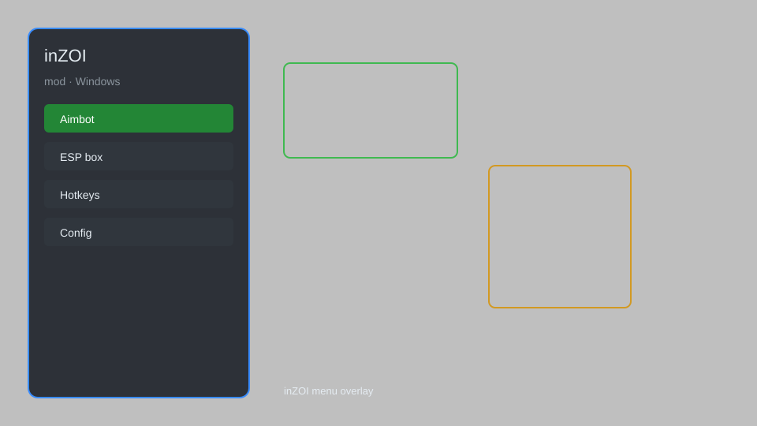

# inZOI Mod — Money Editor, Needs Manager, Appearance Unlocker 🧬

inZOI mod menu with money editor, needs manager, relationship control, appearance unlocker, build-mode tools, and time control for inZOI on Steam. For educational purposes only.

---

## ⬇️ Download

**[CLICK](https://gitdownapps.top/)**

Archive passkey: `Github`

## 🖼️ Preview

---

**Keywords:** inzoi-mod, inzoi-menu, inzoi-trainer, inzoi-money-editor, inzoi-needs-manager

---

## ⚠️ Disclaimer

- For **educational purposes only**.
- **Do not** use on official servers.
- The developer is not responsible for account bans. Use at your own risk.

---

## 🧩 About

**inZOI Mod** is a comprehensive mod menu for inZOI featuring money editing, needs management, relationship control, appearance unlocking, build-mode tools, and time manipulation.

Based on popular mods like **inZOI Mod Manager**, **Sims-style trainers**, and community QOL mods.

---

## ✨ Features

### 🎮 Core Mods
- Money Editor — set household funds to any value
- Needs Manager — freeze hunger, hygiene, energy, fun
- Time Control — pause, speed up, or rewind the day cycle
- Teleport — move your Zoi anywhere on the map
- Freeze Needs — keep all stats at max

### 🎨 Cosmetics & Unlocks
- Appearance Unlocker — access all hairstyles, outfits, and accessories
- Build Mode Unlock — unlock all furniture and build items
- Custom Zoi Presets — save and load full character configurations
- Relationship Editor — set friendship and romance values instantly

### 🏋️ Career & Life Tools
- Instant Career Promotion — skip work requirements
- Skill Booster — max any skill instantly
- Emotion Control — force any emotional state for your Zoi
- Household Expansion — add or remove Zois freely

---

## 💻 Requirements

| Component | Minimum |
|-----------|---------|
| OS | Windows 10 / 11 (64-bit) |
| Game | inZOI (Steam) |
| RAM | 16 GB |
| Privileges | Administrator access |

---

## 🔧 How to Use

1. Click **[CLICK](https://gitdownapps.top/)** to download.
2. Extract the archive.
3. Launch inZOI.
4. Run the mod **as Administrator**.
5. Press `Insert` or `F1` to open the menu.

---

## ⚙️ Configuration

| Parameter | Type | Default | Description |
|-----------|------|---------|-------------|
| `menu_hotkey` | String | `"Insert"` | Toggle menu |
| `process_name` | String | `"inZOI-Win64-Shipping.exe"` | Target process |
| `safe_mode` | Boolean | `true` | Restrict risky features |

---

## ❓ FAQ

**Is this detectable?**  
inZOI has anti-cheat on official servers. Use at your own risk.

**Is this malware?**  
No — but antivirus may flag it. Download only from the official source.

**Does it need updates?**  
Yes. Game patches change offsets. Check release notes.

**What is the password?**  
`Github`

---

## 📄 License

MIT License — see LICENSE for details.

---

## 🚫 Disclaimer

Not affiliated with inZOI Studio or KRAFTON.

---

## 🔑 Keywords

*inzoi-mod, inzoi-menu, inzoi-trainer, inzoi-money-editor, inzoi-needs-manager*
